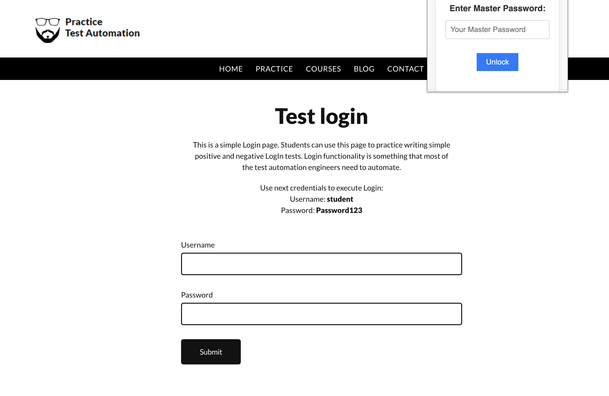
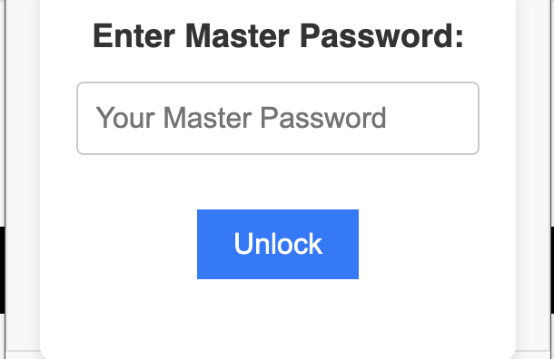
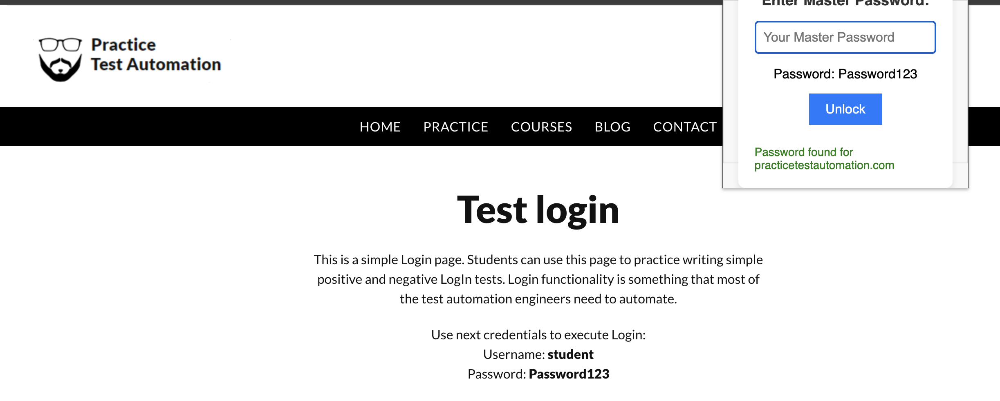

# Local-First Password Manager Extension

This project is a **local-first password manager built as a Chrome extension**. It is designed to help users store and access passwords securely without relying on a company-managed cloud.

The main idea behind the project is simple: your passwords should stay under your control. Instead of sending sensitive credential data to an external service, this extension is built around a **local-first security model**, where password storage and protection happen on the user’s own device.

The extension is designed to detect when a user is about to enter a password and surface the password manager workflow at the right time. This allows the user to unlock their vault with a **master password** and quickly access or manage credentials while keeping the system streamlined and private.

---
## Demo

This project includes a short demo showing the extension in action.

---

## Screenshots
### Main interface

### giving correct password

## What this project is

This project is a Chrome extension that acts as a local password manager.

It is designed to:

- securely store password data locally
- unlock access through a master password
- detect password-entry moments in the browser
- help users manage credentials without depending on a centralized cloud backend
- reduce trust in third-party platforms by keeping sensitive data on-device

The goal is to create a privacy-focused password management workflow where the user stays in control of both access and storage.

---

## Why I built this

A lot of password managers are convenient, but they often rely on a company cloud to store, sync, or process highly sensitive credential data.

I wanted to explore a different model: a **local-first solution** where users do not have to worry as much about their passwords being stored in somebody else’s infrastructure.

This project was built to explore the idea that strong password management can be:

- private
- local
- responsive
- user-controlled
- integrated directly into browser workflows

It also gave me the opportunity to think more deeply about browser extension security, local storage protection, and password handling architecture.

---

## Core idea

The core idea behind this project is that a password manager should feel convenient without forcing the user to trust an external cloud platform with their most sensitive credentials.

This extension uses a **master password** as the main gate for access. When the extension detects that the user is about to enter a password, it can surface the password manager flow so the user can unlock and retrieve the appropriate credentials securely.

Because the system is local-first, sensitive password data stays on the device rather than being pushed to a central cloud service.

---

## Key features

### Local-first storage
The password vault is designed to be stored locally, reducing dependence on external servers and minimizing exposure to third-party infrastructure.

### Master password protection
The system uses a master password to control access to the vault, so users only need to remember one strong secret to unlock their stored credentials.

### Browser-aware workflow
The extension is designed to detect when a password is likely about to be entered, allowing it to surface the password management flow contextually instead of requiring users to manually open it every time.

### Password protection through hashing
This project explores custom password protection logic based on combining multiple hashing ideas into a single workflow. The goal was to experiment with strengthening local credential protection through layered hashing design.

### Chrome extension integration
Because the project is built as a browser extension, it can fit naturally into the places where passwords are actually used.

---

## Tech stack

This project is built with:

- **JavaScript / TypeScript** for extension logic
- **Chrome Extension APIs**
- **Local browser storage**
- **Custom password hashing workflow**
- **Browser event and form detection logic**

Depending on the final implementation, it may also include:
- popup UI logic
- content scripts
- background scripts / service workers
- local encryption or secure storage helpers

---

## How it works

At a high level, the system works like this:

1. The extension runs in the browser and monitors relevant page contexts.
2. When it detects a password-entry flow, it can surface the password manager interface.
3. The user unlocks the vault using their master password.
4. Stored credentials are retrieved locally.
5. Password data remains under local control rather than being sent to an external cloud service.

This makes the extension feel integrated into real browser usage while still following a privacy-focused model.

---

## Security model

This project is centered around a **local-first security philosophy**.

That means the design prioritizes:

- keeping sensitive password data on the user’s own device
- reducing unnecessary third-party trust
- protecting vault access behind a master password
- making password handling fit naturally into browser behavior
- minimizing exposure compared with systems that depend heavily on remote storage

The project also explores a custom hashing design to protect password-related data locally.

---

## About the hashing approach

This project includes a hashing workflow that I designed by combining ideas from multiple hashing approaches.

The purpose of that design was to experiment with layered password protection and think more carefully about how password-related data should be secured in a local-first environment.

The hashing system is meant to support the larger goal of protecting stored credential information behind the master password flow.

> If this project is ever expanded further, the hashing and security model should be reviewed carefully against modern password security best practices and threat models before production use.

---

## Why local-first matters

Local-first matters because passwords are some of the most sensitive pieces of data a person has.

If credential storage depends entirely on a company-managed cloud, users are placing a large amount of trust in external infrastructure, business decisions, and security controls they do not personally control.

A local-first approach changes that model by keeping the vault closer to the user and reducing the number of places that sensitive data can be exposed.

This project is built around that philosophy.

---

## What I learned

This project helped me think more deeply about:

- browser extension architecture
- credential handling workflows
- local-first security design
- password protection logic
- user experience around authentication
- how to make a security tool feel convenient without weakening privacy goals

It also pushed me to think about the balance between usability and security, which is one of the hardest parts of building tools like this.

---

## Challenges

Some of the most interesting challenges in this project include:

- detecting password-entry moments reliably in the browser
- building a smooth unlock flow around a master password
- protecting local credential data properly
- designing a system that is private without becoming inconvenient
- integrating securely with Chrome extension APIs
- thinking carefully about how hashing, storage, and retrieval fit together

These challenges are part of what made the project interesting from both a systems and security perspective.

---

## Future improvements

Some possible directions for expanding this project include:

- stronger vault organization and credential search
- better autofill support
- site-specific credential matching
- improved local encryption workflows
- security hardening and audit review
- session timeout and re-lock logic
- password generation tools
- breach-checking workflows that preserve privacy
- support for secure backup/export models
- cross-device sync with end-to-end encryption while preserving local-first principles

---

## Final note

This project is a local-first password manager built as a Chrome extension to give users a more privacy-focused way to manage credentials.

The main goal is to reduce dependence on company cloud storage, keep password data under the user’s control, and create a workflow where unlocking and using credentials feels integrated directly into the browser.

It was also a chance for me to explore how security, convenience, and browser automation can come together in one system.